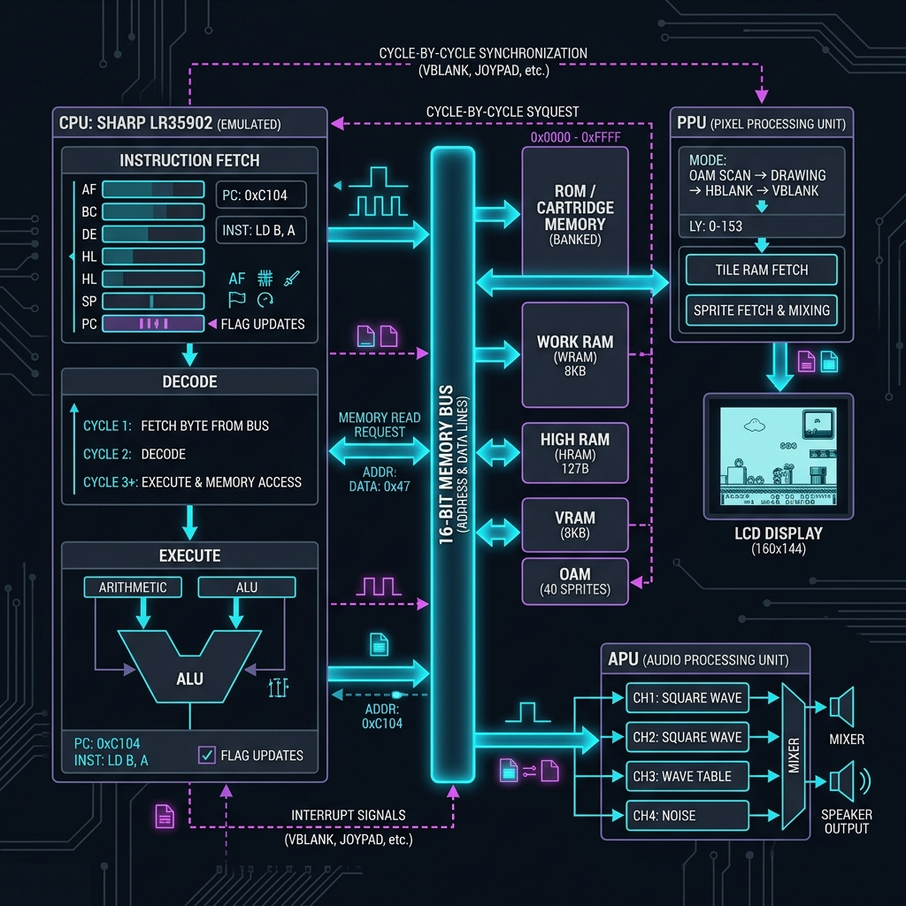
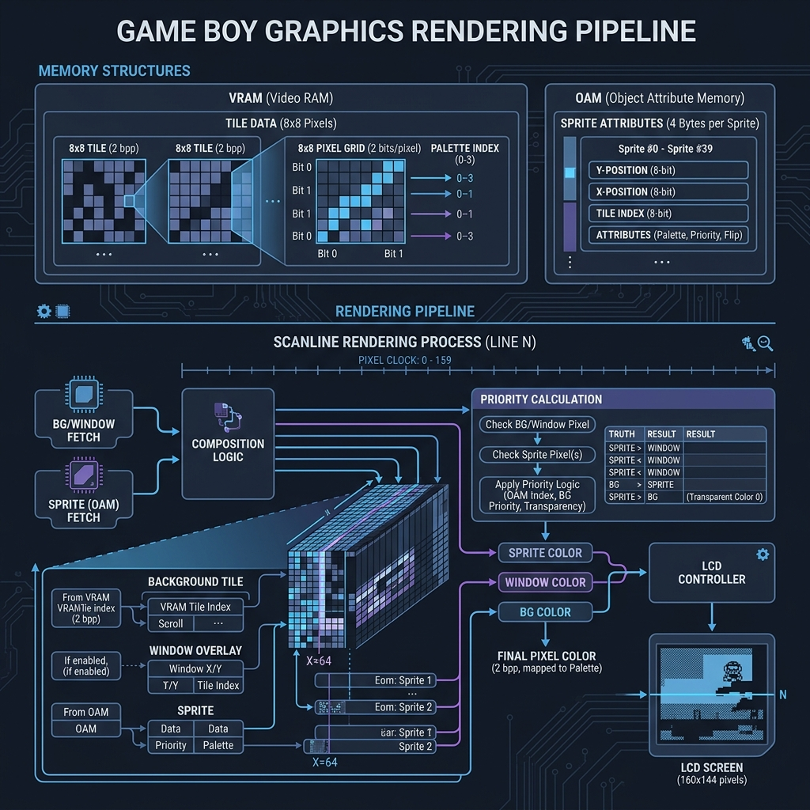
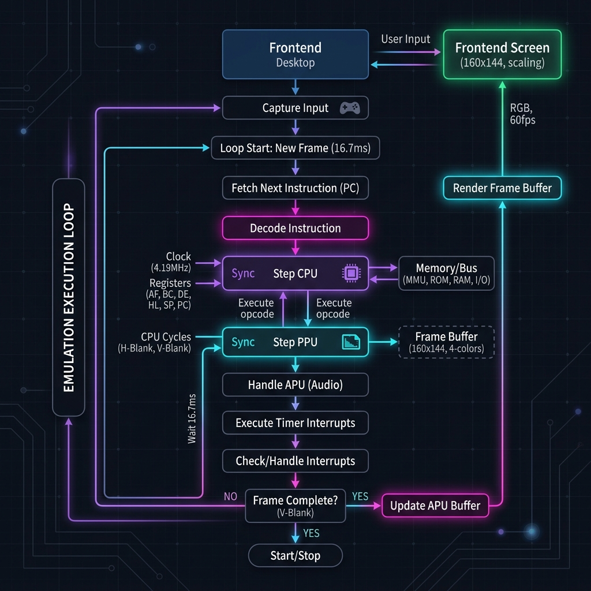

# Code Tour: How the Game Boy Emulator Works

Welcome to the technical tour of the Game Boy emulator! This document details the emulator's architecture, explaining the code execution flow, the memory map, and the graphics/sprite rendering engine.

Throughout this guide, we will use diagrams, real code examples from the project, and analogies to illustrate how the different emulated hardware modules cooperate in Rust.

---

## 1. Overview of the Architecture and Synchronization

The emulator is split into two main parts:
1. **The Core (`core-gb`):** Contains the pure emulation of the hardware components (CPU, Memory Bus, PPU, APU, Cartridge).
2. **The Frontend (Desktop - `frontend-desktop`):** Handles the graphics window, user input, audio playback, and the 60 FPS rendering loop using the `minifb` library.

Below is the emulator architecture diagram, illustrating how the components interconnect via the Memory Bus and how the CPU and PPU synchronize:



### Cycle-Accurate Synchronization

One of the greatest challenges when emulating a classic console like the Game Boy is maintaining the timing synchronization between the Central Processing Unit (CPU) and the Picture Processing Unit (PPU). In the real console, both chips run in parallel at fixed frequencies (CPU at ~4.19 MHz).

To achieve this efficiently and accurately in Rust, the emulator uses a **step-synchronized** design:
1. The CPU executes a single instruction by calling `step()` in [cpu.rs](file:///C:/Users/kanib/source/repos/gb-gba-emulator/core-gb/src/cpu.rs#L519).
2. This execution returns a `StepResult` containing the number of clock cycles (M-cycles) it took to complete that instruction (typically between 4 and 24 cycles).
3. Immediately after, the emulator advances the PPU by that **same number of cycles** by calling `ppu.step()` in [ppu.rs](file:///C:/Users/kanib/source/repos/gb-gba-emulator/core-gb/src/ppu.rs#L152).
4. This process repeats in a loop inside `run_frame()` in [lib.rs](file:///C:/Users/kanib/source/repos/gb-gba-emulator/core-gb/src/lib.rs#L235) until the PPU reports that it has completed rendering a full frame (154 scanlines completed).

> [!NOTE]
> **The Narrator and the Film Projector Analogy:**  
> Imagine the **CPU** is a narrator reading a script (the game instructions). Each sentence he reads takes a different amount of time (cycles). The **PPU** is a film projector drawing the movie on the screen. To prevent the narrator from talking about a scene that the screen has not yet shown, every time the narrator finishes reading a 10-second sentence, we force the projector to advance exactly 10 seconds of film. This keeps the image and the code execution perfectly in sync.

---

## 2. Code Execution Engine: CPU and Memory Bus

### The Sharp LR35902 CPU (`cpu.rs`)

The Game Boy's CPU ([Cpu](file:///C:/Users/kanib/source/repos/gb-gba-emulator/core-gb/src/cpu.rs#L140)) is a hybrid variant between the Intel 8080 and the Zilog Z80. It is an 8-bit processor with a 16-bit address space.

#### Status Register and Flags (`Registers`)
The CPU has several registers represented in the [Registers](file:///C:/Users/kanib/source/repos/gb-gba-emulator/core-gb/src/cpu.rs#L97) struct:
- Individual 8-bit registers: `A`, `B`, `C`, `D`, `E`, `H`, `L`, and `F` (Flags register).
- Combined 16-bit register pairs for memory addressing: `BC`, `DE`, and `HL` (implemented in `cpu.rs` via helper methods like `bc()`, `de()`, and `hl()`).
- 16-bit control registers: `SP` (Stack Pointer) and `PC` (Program Counter).

The `F` register stores status flags updated after arithmetic or logical operations:
- **Z (Zero Flag, Bit 7):** Set if the result is zero.
- **N (Subtract Flag, Bit 6):** Set if the last operation was a subtraction.
- **H (Half-Carry Flag, Bit 5):** Set if there was an overflow from bit 3 to bit 4 (nibble-level carry).
- **C (Carry Flag, Bit 4):** Set if there was an overflow from bit 7 to bit 8.

> [!NOTE]
> **What is a Nibble?**  
> A *nibble* (or half-byte) is a unit of data comprising **4 bits** (exactly half of an 8-bit byte).
> Since 4 bits can represent 16 unique values (`0` to `15`), a nibble maps directly to a single hexadecimal digit (e.g., `0x0` to `0xF`).
> In 8-bit architectures like the Game Boy, bytes are often split logically into a **high nibble** (upper 4 bits) and a **low nibble** (lower 4 bits). The auxiliary carry (*half-carry*) detects when an addition in the low nibble overflows and carries over into the high nibble (i.e., when a carry is generated from the sum of the first 4 bits).

#### The Fetch-Decode-Execute Loop
The main [Cpu::step](file:///C:/Users/kanib/source/repos/gb-gba-emulator/core-gb/src/cpu.rs#L519) method simulates the physical execution of the CPU:

1. **Fetch:** Reads the 8-bit operation code (opcode) pointed to by the Program Counter (`PC`) from the bus, and increments `PC` by 1.
   ```rust
   let opcode = self.fetch8(bus);
   ```
2. **Decode & Execute:** Uses a large `match` block in Rust to identify the instruction matching the fetched byte and executes its logic:
   ```rust
   let step_result = match opcode {
       0x00 => StepResult::new(4, false), // NOP: No operation, takes 4 cycles.
       0x06 => {
           // LD B, n: Load immediate byte into register B.
           self.registers.b = self.fetch8(bus);
           StepResult::new(8, false)
       }
       // ... other 254 opcodes
       0xCB => {
           // Bit instructions prefixed with 0xCB
           let cb_opcode = self.fetch8(bus);
           self.execute_cb(cb_opcode, bus)
       }
   }
   ```
3. **Delayed Interrupt Enable:** Handles the delayed enabling of interrupts caused by the `EI` (Enable Interrupts) instruction.

#### Halt and Interrupts
When the game executes the `HALT` instruction, the CPU enters a low-power state (`self.halted = true`) and stops executing instructions. It only wakes up when the Bus triggers a pending interrupt.

The interrupt system ([Cpu::service_interrupt](file:///C:/Users/kanib/source/repos/gb-gba-emulator/core-gb/src/cpu.rs#L471)) handles 5 asynchronous event sources in order of priority:
1. **VBlank (0x40):** When the PPU finishes drawing the visible screen.
2. **LCD STAT (0x48):** LCD status changes (such as scanline comparisons).
3. **Timer (0x50):** Internal timer counter overflow.
4. **Serial (0x58):** Link Cable serial transfer completion.
5. **Joypad (0x60):** Physical button press input.

When an enabled interrupt occurs and global interrupts (`IME`) are active:
- The `IME` flag is cleared (disabling further interrupts).
- The current `PC` address is pushed onto the stack (`push16`).
- The CPU jumps to the corresponding interrupt vector address (e.g., `0x0040` for VBlank).
- This servicing process consumes 20 CPU cycles.

---

### The Memory Bus and MMU (`bus.rs`)

The [Bus](file:///C:/Users/kanib/source/repos/gb-gba-emulator/core-gb/src/bus.rs#L112) struct acts as the memory management unit (MMU), mapping the CPU's 16-bit virtual address space (range `0x0000` to `0xFFFF`) to different physical hardware components:

| Address Range | Destination / Mapped Hardware | Implementation in Code |
| :--- | :--- | :--- |
| `0x0000 - 0x7FFF` | Cartridge / Game ROM (Switchable banks) | [Cartridge::read_rom](file:///C:/Users/kanib/source/repos/gb-gba-emulator/core-gb/src/cartridge.rs) |
| `0x8000 - 0x9FFF` | Video RAM (VRAM) | `self.vram` (Bank-switchable on GBC) |
| `0xA000 - 0xBFFF` | Cartridge Save RAM (SRAM) | [Cartridge::read_ram](file:///C:/Users/kanib/source/repos/gb-gba-emulator/core-gb/src/cartridge.rs) |
| `0xC000 - 0xDFFF` | Working RAM (WRAM) | `self.wram` (Banks 0 to 7 on GBC) |
| `0xE000 - 0xFDFF` | Echo RAM (Mirror of `0xC000 - 0xDDFF`) | Redirects by subtracting `0x2000` |
| `0xFE00 - 0xFE9F` | Sprite Attribute Memory (OAM) | `self.oam` |
| `0xFEA0 - 0xFEFF` | Unusable / Reserved Memory | Returns `0xFF`, writes are ignored |
| `0xFF00 - 0xFF7F` | Input/Output (I/O) Registers | `self.io` (Joypad, LCD, Timer, Serial) |
| `0xFF80 - 0xFFFE` | High RAM (HRAM) | `self.hram` |
| `0xFFFF` | Interrupt Enable Register (IE) | `self.ie` |

#### Reading and Writing on the Bus
All memory reads and writes are done via `read8(address)` and `write8(address, value)`.

The bus is responsible for intercepting writes to special registers that trigger complex hardware logic. For example, the **OAM DMA (Direct Memory Access)** mapped to the I/O register `0xFF46` ([bus.rs](file:///C:/Users/kanib/source/repos/gb-gba-emulator/core-gb/src/bus.rs#L649)):
```rust
if address == 0xFF46 {
    // Writing a value X to 0xFF46 triggers a DMA transfer,
    // automatically copying 160 bytes from the source (X * 0x100) to OAM.
    let source = u16::from(value) << 8;
    for offset in 0..OAM_SIZE {
        self.oam[offset] = self.read8(source + offset as u16);
    }
}
```

#### System Timers (`tick_timer`)
The [Bus::tick_timer](file:///C:/Users/kanib/source/repos/gb-gba-emulator/core-gb/src/bus.rs#L813) method simulates the Game Boy's internal timer hardware:
- **DIV Register (`0xFF04`):** Increments every 256 CPU cycles. Writing any value to this register resets it to `0`.
- **TIMA Register (`0xFF05`):** Increments at a frequency configured by the `TAC` control register. When `TIMA` overflows past `255`, it reloads the value stored in the `TMA` modulo register (`0xFF06`) and requests a timer interrupt (Bit 2 in `0xFF0F`).

---

## 3. Graphics and Sprite Rendering: PPU and OAM

The Picture Processing Unit ([Ppu](file:///C:/Users/kanib/source/repos/gb-gba-emulator/core-gb/src/ppu.rs#L103)) is the console's graphics engine. It renders the screen scanline-by-scanline, matching the timing of old CRT monitors.

### Scanline Flow and LCD Modes
The Game Boy screen has a physical resolution of 160x144 pixels. However, to simulate the vertical blanking intervals of classic tube displays, the PPU calculates **154 scanlines** in total. Each scanline takes exactly **456 CPU cycles** to process, resulting in a total of **70,224 cycles per frame** (~59.73 Hz).

During each visible scanline (0-143), the PPU transitions through three modes represented in the `STAT` register (`0xFF41`):

```text
|<------------- 456 CPU Clock Cycles per Scanline ------------->|
+-------------------+----------------------------+--------------------+
| Mode 2: OAM Search| Mode 3: Pixel Transfer     | Mode 0: HBlank     |
| (80 cycles)       | (approx. 172 cycles)       | (approx. 204 cycles|
| Scans OAM for     | Reads tile and sprite data | End of line sleep, |
| sprites on line   | and draws pixels           | CPU has memory access
+-------------------+----------------------------+--------------------+
```

- **Mode 2 (OAM Search):** First 80 cycles. The PPU scans OAM memory to find which sprites overlap vertically with the current scanline (up to 10 sprites maximum per line).
- **Mode 3 (Pixel Transfer):** Next 172 cycles. The PPU reads tile data and sprite attributes, mixing them to draw pixels to the framebuffer.
- **Mode 0 (HBlank):** Rest of the cycles (approx. 204 cycles). The PPU enters horizontal sleep. VRAM and OAM are fully accessible by the CPU.
- **Mode 1 (VBlank):** Occurs continuously during scanlines 144 to 153. A VBlank interrupt is requested, signaling the game code that it can safely update graphical memory without causing screen tearing.

---

### Tile Formats and 2bpp Pixels

All graphics on the Game Boy (both background maps and sprites) are composed of **8x8 pixel** blocks called **Tiles**. Each pixel of a Tile has a color index of 4 possible shades (indices 0, 1, 2, 3), encoded in a **2 bits-per-pixel (2bpp)** format.

In memory, a Tile occupies exactly **16 bytes**. Each 8-pixel horizontal row of a Tile is encoded using **2 consecutive bytes**:
- The first byte stores the least significant bit (LSB) for all 8 pixels.
- The second byte stores the most significant bit (MSB).

#### Example of 2bpp Decoding:
Suppose we read the two bytes representing a horizontal row of a Tile:
- `Byte 1 (LSB): 0x5C` -> binary: `0 1 0 1 1 1 0 0`
- `Byte 2 (MSB): 0x3A` -> binary: `0 0 1 1 1 0 1 0`

To calculate the color index of each pixel from left to right (bit 7 to bit 0):

```text
Pixel Number:     0   1   2   3   4   5   6   7
-------------------------------------------------
Byte 2 Bit (MSB): 0   0   1   1   1   0   1   0
Byte 1 Bit (LSB): 0   1   0   1   1   1   0   0
-------------------------------------------------
Binary Index:     00  01  10  11  11  01  10  00
Decimal Index:    0   1   2   3   3   1   2   0
```

> [!TIP]
> **The Rug Weaving Analogy:**  
> Imagine weaving a pixelated rug with colored threads. For each point on the rug, you inspect two threads stacked on top of each other: a red thread (Byte 1) and a blue thread (Byte 2). If both threads are absent, you color the point white (0). If only the red thread is present, you color it light gray (1). If only the blue thread is present, you color it dark gray (2). If both are present, you color it black (3). Layering both threads gives you the final pattern.

This process is implemented in [Ppu::render_frame](file:///C:/Users/kanib/source/repos/gb-gba-emulator/core-gb/src/ppu.rs#L281) to extract pixel colors:
```rust
let b1 = bus.read8(line_addr);         // Byte 1 (LSB)
let b2 = bus.read8(line_addr + 1);     // Byte 2 (MSB)

let bit = 7 - tile_col; // Reading left-to-right
let color_index = ((b2 >> bit) & 1) << 1 | ((b1 >> bit) & 1);
```

---

### Grayscale DMG Palette Mapping
The decoded color indices (0-3) are not drawn as fixed shades. Instead, they pass through a palette mapping register:
- **BGP (`0xFF47`):** Palette map for the Background.
- **OBP0 / OBP1 (`0xFF48`/`0xFF49`):** Palette maps for Sprites.

Each palette byte assigns one of 4 final gray shades (0 = White, 1 = Light Gray, 2 = Dark Gray, 3 = Black) to each index (0-3). Every shade takes up 2 bits:
```rust
let shade = (palette >> (color_index * 2)) & 0x03;
```
This allows game software to perform full-screen flashes or fade-out effects by simply modifying the palette registers, rather than updating all graphical data in VRAM.

---

### Sprite (OAM Objects) Rendering

Moving characters and items on screen are represented by **Sprites**. Unlike the static background layer, sprites are read from **OAM (Sprite Attribute Memory)**, which supports up to 40 individual sprite objects.

The diagram below details the sprite rendering process in the PPU:



#### OAM Sprite Attribute Structure
Each sprite in OAM occupies exactly **4 bytes**:
1. **Byte 0: Y Position.** The vertical screen coordinate of the sprite, offset by `-16` (to allow drawing sprites partially off the top edge of the screen).
2. **Byte 1: X Position.** The horizontal coordinate, offset by `-8` (allowing sprites to slide off the screen edges).
3. **Byte 2: Tile Index.** Points to the starting Tile in VRAM (range `0x8000-0x8FFF`).
4. **Byte 3: Flag Attributes.**
   - **Bit 7 (Priority):** Drawing priority (0 = Draw on top of background, 1 = Draw behind background colors 1, 2, and 3).
   - **Bit 6 (Y-Flip):** Inverts the sprite vertically if set to 1.
   - **Bit 5 (X-Flip):** Inverts the sprite horizontally if set to 1.
   - **Bit 4 (Palette Select):** Selects which palette to use (0 = `OBP0`, 1 = `OBP1`).

#### Step-by-Step Sprite Rendering Process
The sprite drawing algorithm in [Ppu::render_sprites](file:///C:/Users/kanib/source/repos/gb-gba-emulator/core-gb/src/ppu.rs#L382) works as follows:

1. **Size Selection:** Depending on Bit 2 of the LCDC register, sprites are either **8x8 pixels** (using 1 Tile) or **8x16 pixels** (using 2 vertically contiguous Tiles).
2. **Sprite Loop:** The PPU iterates sequentially through all 40 sprites in OAM.
3. **Coordinate Bounds Check:** If the sprite lies entirely off-screen or does not overlap the current scanline being rendered, the PPU skips it.
4. **Flipping Calculations:**
   - If `y_flip` is active, the vertical lines are read backward: `tile_y = sprite_height - 1 - sy`.
   - If `x_flip` is active, the horizontal bits are read backward: `bit = sx` (otherwise, `bit = 7 - sx` from left to right).
5. **Transparency:** For sprites, **Color index 0 is always transparent**. If the decoded sprite pixel has index 0, it is not drawn, and the background remains visible.
6. **Priority Resolution:**
   - If the sprite priority flag is `0` (on top), the sprite pixel is always drawn over the background.
   - If the sprite priority flag is `1` (behind), the sprite is only drawn if the current background pixel color index is `0` (background transparent color).

```rust
// Sprite priority logic implemented in Rust:
if priority {
    // Behind background: only draw if the background color is 0
    let bg_color = self.framebuffer[pixel_idx];
    if bg_color == 0 {
        self.framebuffer[pixel_idx] = shade;
    }
} else {
    // In front of background: always draw
    self.framebuffer[pixel_idx] = shade;
}
```

> [!TIP]
> **The Paper Cutouts and Glass Analogy:**  
> Think of screen rendering as assembling a paper cutout collage. The background is a large painting on solid white poster board. Sprites are characters drawn on clear, transparent plastic sheets.
> The OAM memory gives the coordinates of where to place each transparent sheet. "Color 0" is the clear part of the plastic where nothing was drawn.
> The "Priority" flag decides whether you slide the plastic sheet **above** the background poster board (always visible) or **behind** it through pre-cut windows. If the background poster has a colored drawing (color 1-3) on top of the window, the character behind it will be obscured.

---

## 4. The Complete Execution Cycle: Component Integration

To conclude, let's look at how all these components interact during a single emulation frame loop. Every frame cycle (~16.6ms at 60 FPS) carries out the following steps:



This continuous cycle running at 60 frames per second is what allows gameplay to remain smooth and fluid, recreating the classic Game Boy experience on modern hardware.
